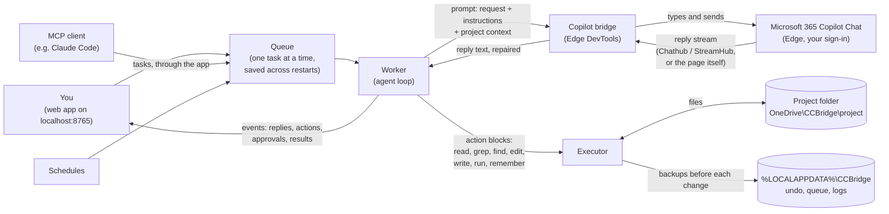
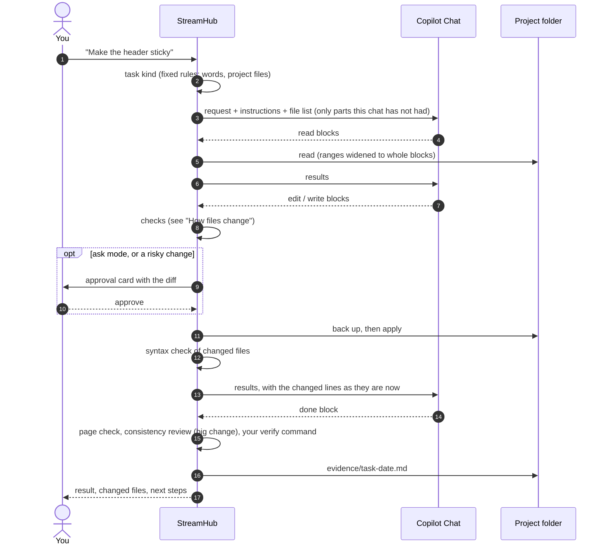
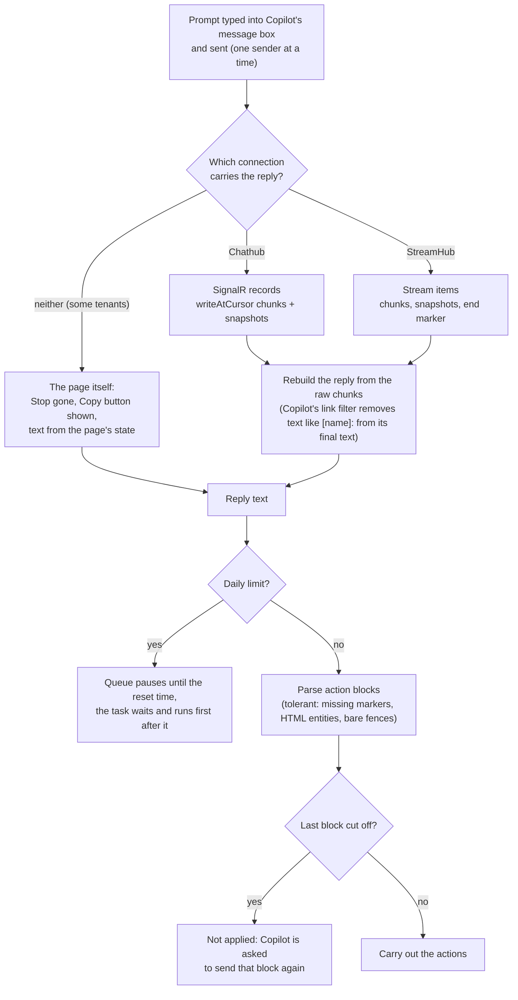
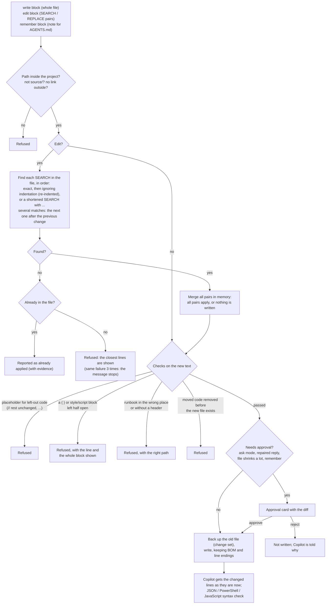
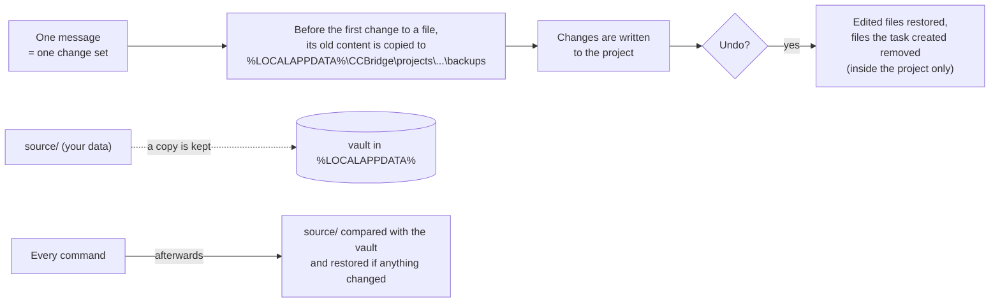
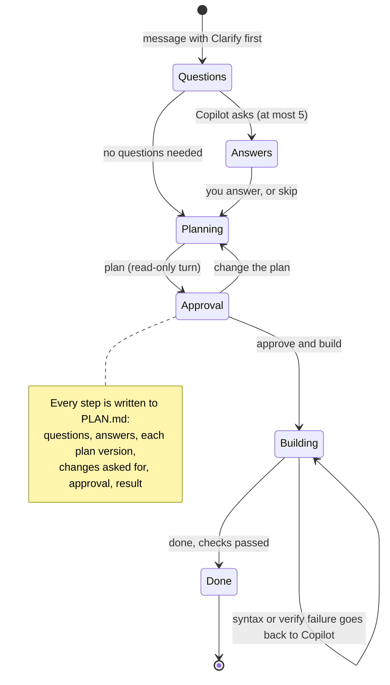

# StreamHub

_Formerly CCBridge. The scripts (`start.cmd`, `ccbridge.ps1`), the data folder `%LOCALAPPDATA%\CCBridge`, the projects folder `OneDrive\CCBridge`, the MCP server id `ccbridge` and the repository keep that name, so existing installs and settings keep working._

A local coding harness that uses **Microsoft 365 Copilot Chat** (in Microsoft Edge) as its model, with **zero installation**: it runs on Windows PowerShell 5.1 and the Edge browser that ship with Windows. No admin rights, no Node, no Python on the target machine.

You describe what you want in a web interface on `http://localhost:8765` (or from an MCP client such as Claude Code). StreamHub types the request into Copilot Chat, reads the reply, and carries out the actions Copilot asks for (read and search files, write and edit files, run commands) inside a project folder, with your approval.

```
 you ──► StreamHub web app / MCP client
            │  prompt + project context          ▲  actions, diffs, approvals, results
            ▼                                     │
         Copilot Chat in Edge (your sign-in) ─────┘
```

Automating Copilot Chat may be subject to your organisation's policies; check before use.

---

## Contents

- [Quick start](#quick-start)
- [Features](#features)
- [Using the web app](#using-the-web-app)
- [MCP server](#mcp-server)
- [Microsoft 365 data (Work IQ) and human in the loop](#microsoft-365-data-work-iq-and-human-in-the-loop)
- [Install and updates](#install-and-updates)
  - [Updating](#updating)
- [Configuration](#configuration)
- [Logging and diagnostics](#logging-and-diagnostics)
- [Troubleshooting](#troubleshooting)
- [How it works](#how-it-works) (diagrams)
- [Where StreamHub keeps its data](#where-streamhub-keeps-its-data)
- [Development](#development)

---

## Quick start

1. Install (PowerShell, no admin rights):
   ```powershell
   powershell -NoProfile -ExecutionPolicy Bypass -Command "irm https://raw.githubusercontent.com/jgt87/CCBridge/main/install.ps1 | iex"
   ```
2. Start **StreamHub** from the desktop or Start menu. An Edge window opens Copilot Chat in a separate profile: sign in once with your Microsoft 365 account. The interface opens at `http://localhost:8765`.
3. Create a project (it lives in `OneDrive\CCBridge\<name>`), type what to build, and approve the changes Copilot proposes.
4. To update later: just restart StreamHub (it updates itself at every start), or double-click `update.cmd`. See [Updating](#updating).

Requirements: Windows 10/11, Windows PowerShell 5.1 in FullLanguage mode, Microsoft Edge, a Microsoft 365 Copilot Chat account, OneDrive for the web app. `probe.cmd` checks a machine and writes `probe-report.txt`.

---

## Features

### Web app
- Chat with Copilot about a project; replies render as markdown, with Copilot's actions shown as cards.
- **Three modes** (chat box, bottom left): *Ask before changes* (approve every file change and command), *Auto-accept edits* (file changes apply directly, commands still need approval), *Plan only* (Copilot can read and discuss, nothing is changed or run).
- **Approvals**: file changes show a diff with *Apply change* / *Reject* (optionally with a note for Copilot); commands need a press-and-hold on *Hold to run*. An action approved by another program (the local API or MCP) is marked *via API* / *via MCP* on its card and in the log, so you can always tell who approved what.
- **Stop** (square button while Copilot works) acts immediately: it presses Copilot's own Stop while it is writing, kills a running command with everything it started, or rejects a pending approval. Changes made so far stay undoable.
- **New chat** starts a fresh Copilot conversation and a clean chat view (stopping the current step first if needed); the Changes tab keeps the undo history.
- **Side panel** (left): *Files* (project tree, upload of source data, click to view a file; changed files show `+added -removed` line counts since the project was opened, folders show their totals), *Tasks* (Copilot's checklist), *Changes* (every message is a change set; *Undo last change set*).
- **Menu** (top right, or Ctrl+K): new Copilot chat, undo, switch project, attach a file, change mode, open any file, verbose logging on/off, export diagnostics.
- Attach files to a message with `@path` (or the @ button) so Copilot gets their full content.
- Monochrome, flat interface built with [Kokonut UI](https://kokonutui.com) components; served from prebuilt files, so the target machine never needs Node.

### Agent and actions
Copilot works through fenced *action blocks* that StreamHub executes and answers with results, in rounds, until Copilot reports `done`:

| Action | What StreamHub does | Approval |
|---|---|---|
| `read` | Returns full file contents | automatic |
| `glob` | Lists files matching a pattern | automatic |
| `grep` | Searches file contents (regex, optional file filter) | automatic |
| `write` | Creates or replaces a file | per mode |
| `edit` | Applies SEARCH/REPLACE pairs to a file (all or nothing) | per mode |
| `run` | Runs a command with cmd.exe in the project folder (output trimmed) | always, unless allow-listed |
| `todo` | Updates the task checklist | automatic |
| `done` | Ends the task with a summary | automatic |

- **Minimal prompts**: what StreamHub sends follows your request. A greeting or general question goes to Copilot exactly as typed. Email, calendar, meeting and chat questions get a short personal-assistant role, the read-only rule for Microsoft 365 data and how to save a file. Project and coding work gets a short role, a compact description of the actions (with placeholders, no example files) and the project context: its **OneDrive location** (as a web link for OneDrive for Business), so Copilot can open the files there, the file list and `AGENTS.md` if you filled it in. Later messages in the same chat only add what is still missing.
- Project instructions in `AGENTS.md` (created with each project) are sent to Copilot at the start of every chat, together with the file list.
- Paths are confined to the project folder; existing line endings and byte-order marks are preserved.

### Safety
- **Undo**: every message is one change set; the previous versions of changed files are kept outside OneDrive and *Undo last change set* restores them (and removes files the task created).
- **Read-only source data**: files you add with *Add source data* go to the project's `source/` folder. Copilot may read them but never change, move or delete them: writes there are refused, and after every command StreamHub restores anything that was changed or deleted from a backup copy (files dropped into `source/` are moved to `work/`).
- **Human in the loop for Microsoft 365** (see [below](#microsoft-365-data-work-iq-and-human-in-the-loop)).
- The web API only accepts requests from the StreamHub page itself (per-installation token, localhost only).

### Copilot handling
- **Reply repair**: Copilot's own link/citation filter deletes code such as `[name]:` or `[guid]::NewGuid()` from its final text. StreamHub rebuilds replies from the raw stream and flags the rare cases where it had to guess.
- Copilot's page turns `<` and `>` in prompts into `&lt;`/`&gt;`; StreamHub matches and repairs that in code (not in HTML/XML/Markdown).
- **Limits**: shows the messages used in the current Copilot chat and starts a fresh chat with a summary before the per-chat limit; warns when daily Copilot credits run low and stops cleanly when they run out.
- Prompts up to the configured budget (default 75,000 characters); Copilot's page accepts up to 128,000.

### MCP server
The same bridge and agent loop for MCP clients (Claude Code, VS Code, ...), in any project folder, with background jobs, approvals and undo. See [MCP server](#mcp-server).

### Install, updates and diagnostics
- One-line install, automatic updates from GitHub Releases at every start, machine settings kept in `*.local.json` files.
- Diagnostic log with masking of personal data and a one-click diagnostics bundle for hand-off.

---

## Using the web app

1. **Projects**: on first start choose or create a project. Projects are folders in `OneDrive\CCBridge`; StreamHub reopens the last one next time. Switch with *Switch worktree* in the header or in Menu.
2. **Ask**: type in the chat box and press Enter. Add files with `@path`, or only some lines with `@path:120-180`. Pick the mode in the chat box. Arrow Up in the box brings back your previous messages (Arrow Down goes forward again, back to what you were typing). All reading happens locally in PowerShell; Copilot gets the contents in the prompt. It reads parts of large files itself (`read index.html:181-420`, usually after a `grep` that returns `PATH:LINE` hits), and a file that does not fit is cut at a whole line with a note on how to read the rest.
3. **Watch and approve**: while Copilot works you see its text, its actions as cards and its checklist under *Tasks*. Approve or reject changes; hold to run commands.
4. **Review**: the *Changes* tab lists change sets; *Undo last change set* reverts the newest one. Click any file to view it.
5. **Source data**: drop files on *Add source data* (Files tab). They are read-only for Copilot; ask it to produce outputs from them (it writes to other folders).
6. **Stop**: the square button stops right away, also in the middle of Copilot's reply or a running command.
7. **New chat**: *New chat* in the chat box header starts a fresh Copilot conversation with an empty chat view (the project stays open). The counter next to it shows messages used in the current chat.
8. **Review after big changes**: when a task changed at least 40 lines, or moved code out of a file into a new one, StreamHub checks the changed files locally (JSON and PowerShell syntax, and that files referenced from HTML, JavaScript and CSS exist) and then asks Copilot once to review them for leftovers, dead code and broken references, fixing real problems through the usual approvals. Costs at least one Copilot message; `reviewAfterChanges` (`big`, `always`, `off`) and `reviewMinLines` in `config\harness.local.json` change it.
9. **Page check**: after a task changed web files (HTML, CSS, JavaScript, JSON), StreamHub opens the changed page (or `index.html`) in a hidden Edge tab, served read-only from the project, and collects JavaScript errors, console errors and files that fail to load (a missing `styles.css`, a `fetch()` of a JSON file that is not there). Problems go to Copilot in the review after the task. `pageCheck` (`on`/`off`) in Settings.
10. **Settings**: the gear next to Menu (or Menu > Settings) shows pacing, waiting, retries, checks, timeouts and sizes for this computer; changes apply right away and are kept across updates (in `config\harness.local.json`).
11. **Suggested next steps**: when Copilot's reply lists "Next steps" (or says "the next step is to ..."), they appear under the reply; click one to put it in the message box, adjust it if needed and send it.
12. **Runbooks**: repeatable, read-only exports of Microsoft 365 data (via Work IQ) to JSON. In the Fetch tab, *New runbook from a template* copies one of the templates (meetings in a period, emails waiting for my reply, decisions and action items from Teams, recently shared or changed documents, a topic digest, or a blank one) to `runbooks/<name>.runbook.md`. Each runbook states its purpose, sources, period, what to include, the exact JSON shape with an example, field rules (dates with time-zone offset, `null` for unknown, never invent) and quality rules (every item, no summarising, deduplicate, `truncated` instead of silently cutting, read-only). Its header (`title`, `output`, `itemsKey`, `required`, `requiredItemFields`, and own values such as `topic:`) is used by StreamHub; placeholders such as `{{today}}`, `{{weekStart}}`, `{{today-7d}}`, `{{timezone}}` are filled in at run time. *Run* asks Copilot in a fresh chat, takes the JSON from its reply and checks it against the header; when it does not match, Copilot gets the problems and one retry. A valid result is saved to the output file (for example `exports/meetings.json`) plus a dated copy in `exports/history/`; a failed run keeps the previous file.
13. **Fetch prompts**: the *Fetch* tab keeps prompts that get current data, such as "List my meetings for today with times, attendees and the agenda". *New fetch prompt* saves one as `fetch/<name>.prompt.md`; *Run* / *Refresh* asks Copilot in a fresh chat and writes its answer to `fetch/<name>.md` (with when it was fetched and the sources Copilot cited). *Attach* adds `@fetch/<name>.md` to your message; the @ menu shows how old each fetched file is. Copilot only answers in a fetch: action blocks are not carried out, the Microsoft 365 read-only rule applies, and a failed fetch leaves the previous answer file in place. The prompt files are plain text, so you can also edit them in the folder.

Command line, one prompt without the interface:

```powershell
powershell -NoProfile -ExecutionPolicy Bypass -File ccbridge.ps1 -Ping "say hi" -NewChat
```

`start.cmd` / `ccbridge.ps1` options: `-Port <n>`, `-NoBrowser`, `-NoUpdate` (skip the update check once), `-LogLevel off|info|verbose|trace`. If StreamHub is already running, `start.cmd` stops that instance first (it would keep serving its old version after an update) and starts the current one; the open browser tab reconnects by itself. The MCP server and `-Ping` runs are left alone.

---

## MCP server

`mcp/ccbridge-mcp.ps1` exposes the bridge and agent loop to MCP clients over stdio, without the web interface, in **any** project folder.

Register it in Claude Code:

```powershell
claude mcp add ccbridge -s user -- powershell.exe -NoProfile -ExecutionPolicy Bypass -File "%LOCALAPPDATA%\Programs\CCBridge\mcp\ccbridge-mcp.ps1"
```

or in any client's JSON config (with optional verbose logging):

```json
{ "mcpServers": { "ccbridge": {
  "command": "powershell.exe",
  "args": ["-NoProfile", "-ExecutionPolicy", "Bypass", "-File", "C:\\Users\\<you>\\AppData\\Local\\Programs\\CCBridge\\mcp\\ccbridge-mcp.ps1"],
  "env": { "CCBRIDGE_LOG": "verbose" } } } }
```

The server is written for a calling model that may be small: its instructions and tool descriptions tell it, in plain words, to do only small and clear edits itself and to hand everything that needs reasoning to Copilot, preferably with the single-call `copilot_run_task`.

| Tool | What it does |
|---|---|
| `copilot_run_task` | **One call for a whole task**: Copilot does the task in `project_path` and the call returns the full report when it is done (waits up to `wait_sec`, default 600); same options as `copilot_start_task` |
| `copilot_ask` | One prompt to Copilot for anything that needs reasoning (explain, root cause, review, plan, longer text); returns the repaired reply and cited sources; `new_chat`, `work_iq`, `timeout_sec` |
| `copilot_start_task` | Same as `copilot_run_task` but returns at once with a job id, for callers that poll; `mode` `auto` / `plan` / `ask`, `allow_commands`, `new_chat`, `work_iq` |
| `copilot_task_status` | Long-polls (up to `wait_sec`) progress, plan, actions, pending approvals with unified diffs, sources, human-required notices |
| `copilot_approve` | Approves or rejects a pending action in `ask` mode, with an optional note for Copilot |
| `copilot_task_result` | Full report: every action with its output, files changed, done summary, Copilot's last reply |
| `copilot_cancel_task` | Stops a job immediately (Copilot's reply or a running command); changes made so far stay undoable |
| `copilot_new_chat` | Starts a fresh Copilot conversation |
| `copilot_undo` | Reverts the last change set in a project folder |

- Commands only run when the task allows them (`allow_commands`); commands that touch Microsoft 365 or delete data are always refused over MCP.
- The web app and the MCP server can run at the same time: a machine-wide lock makes them take turns with Copilot, and each starts a fresh chat when the other one used Copilot last.

---

## Microsoft 365 data (Work IQ) and human in the loop

With a Microsoft 365 Copilot licence and **Work IQ** on, Copilot can use your Outlook mail, Teams chats and meetings, calendar, OneDrive/SharePoint files and people in your organisation. StreamHub tells Copilot it may use that data when a task needs it, to name its sources, and to write extracted information into project files. **Sources** Copilot cited are listed under each answer (web app) and in MCP results.

- **Work IQ switch**: StreamHub can set the Work IQ toggle per task (chat box header in the web app, `work_iq` in MCP). Because the toggle differs per tenant, run `capture.cmd` once on a licensed machine: it records the toggle's controls (labels and states only, no content) in `capture-report.json`, from which the selector goes into `config\selectors.local.json`. Until then StreamHub leaves the toggle as it is and says so.
- **Human in the loop, always**:
  - Copilot is instructed to use Microsoft 365 data **read-only**: no sending or forwarding mail, no creating, changing or cancelling meetings, no posting in Teams, no sharing or deleting data. When a task needs such an action it prepares it (for example an email draft in `drafts/`) for you to do yourself.
  - StreamHub never clicks anything in Copilot's replies. If Copilot proposes a Microsoft 365 action (a confirmation card or action message), the task **stops** and you are asked to review and confirm or cancel it yourself in the Copilot window.
  - If Copilot's text claims it sent, cancelled or deleted something, StreamHub flags it so you can check Outlook/Teams.
  - Commands that would send mail or reach Outlook, Teams, Exchange, SharePoint or Microsoft Graph, and commands that delete data, always need your explicit approval in the web app (even in auto mode, with a warning) and are refused over MCP.

---

## Install and updates

**Install** (no admin rights; into `%LOCALAPPDATA%\Programs\CCBridge`, with desktop and Start menu shortcuts):

```powershell
powershell -NoProfile -ExecutionPolicy Bypass -Command "irm https://raw.githubusercontent.com/jgt87/CCBridge/main/install.ps1 | iex"
```

Set `$env:CCBRIDGE_DIR` first to install elsewhere. Alternatively download `CCBridge-<version>.zip` from [Releases](https://github.com/jgt87/CCBridge/releases), unzip it anywhere and run `start.cmd`.

### Updating

New versions are published as [GitHub Releases](https://github.com/jgt87/CCBridge/releases). The easiest ways to get one, from least to most effort:

1. **Restart StreamHub.** Every start of StreamHub (and of its MCP server) checks GitHub and installs the newest release before it opens; this takes a few seconds. Offline, or if anything goes wrong, it simply starts the version you have. So normally you do nothing: close the StreamHub window and start it again from the shortcut.
2. **Double-click `update.cmd`** in the StreamHub folder (`%LOCALAPPDATA%\Programs\CCBridge`). It updates right away and tells you the result, for example `updated v0.1.0 -> v0.1.1` or `Already up to date (v0.1.1)`. If StreamHub was running, close and start it again afterwards.
3. **Run the install command again** (see above). It updates the existing installation in place.

Your settings in `config\harness.local.json` and `config\selectors.local.json` are kept by every update. The installed version is in `version.txt` (also shown in `environment.json` of a diagnostics export).

- Turn automatic updates off with `"autoUpdate": false` in `config\harness.local.json` (`update.cmd` still works); for the MCP server alone set the environment variable `CCBRIDGE_NO_UPDATE=1`.
- A git clone updates with `git pull --ff-only` instead (skipped when it has local changes or is on another branch).
- MCP clients start the MCP server when they launch, so restarting the MCP client (for example a new Claude Code session) also picks up a new version.

---

## Configuration

Settings live in `config\harness.json` and `config\selectors.json`. Put your own values in **`config\harness.local.json`** / **`config\selectors.local.json`** (same keys, only the ones you change): updates never overwrite these files.

| `harness` key | Default | Meaning |
|---|---|---|
| `port` | 8765 | Web app port |
| `cdpPort` | 9333 | Edge debug port used to drive Copilot |
| `projectsFolder` | `StreamHub` | Folder under OneDrive for web-app projects |
| `maxRounds` | 12 | Copilot rounds per message before StreamHub pauses |
| `promptCharBudget` | 75000 | Maximum characters sent to Copilot per prompt |
| `resultCharBudget` | 40000 | Maximum characters of action results per round |
| `replyTimeoutSec` | 300 | Wait for one Copilot reply |
| `stallSec` | 90 | Copilot sent nothing for this long: it hangs, so StreamHub presses Stop and reports "stopped without answering" |
| `commandTimeoutSec` | 180 | Maximum run time of a command |
| `rolloverMargin` | 2 | Start a fresh chat this many messages before Copilot's per-chat limit |
| `autoApproveCommands` | `[]` | Regular expressions of commands that run without approval (never applies to risky commands) |
| `workIq` | `leave` | `on`, `off` or `leave` (do not touch the toggle) |
| `saveReplyFrames` | `true` | Keep the raw data of the last 30 Copilot replies for diagnosis |
| `autoUpdate` | (on) | `false` turns automatic updates off |
| `logLevel` | `info` | `off`, `info`, `verbose`, `trace` |

`selectors.json` holds the Copilot address, `chatUrl` (default `https://www.microsoft365.com/chat`, opened at start and when a new chat needs a page reload; it signs in without an extra prompt and may redirect to `m365.cloud.microsoft/chat`), `chatHosts` (the hosts on which StreamHub recognises the Copilot tab), and the CSS selectors for Copilot's message box, Send button and (via `capture.cmd`) the Work IQ toggle. If Microsoft changes the Copilot page, a selector fix in `selectors.local.json` is usually all that is needed.

---

## Logging and diagnostics

### Where and what
- Log files: **`%LOCALAPPDATA%\CCBridge\logs\ccbridge-yyyyMMdd.log`**, one per day, kept 14 days. The web app, the MCP server, the updater and the diagnostics tool all write to the same file.
- One line per event: time, process id, level, component, message, optional JSON data:
  ```
  2026-10-02 01:33:30.746 [33720] INFO    server   Web app started on http://localhost:8765/ {"ccbridge":"v0.1.0","powershell":"5.1.26100.9444",...}
  2026-10-02 02:04:12.118 [33720] VERBOSE bridge   Reply received {"ms":7412,"frames":38,"chars":1620,"uncertain":0,"result":"Success","chat":"3/30","credits":"41/50",...}
  ```
- Components: `server` (web app), `mcp`, `agent` (turns, rounds, actions, approvals), `bridge` (message box, sending, replies), `cdp` (Edge connection), `exec` (commands, risk checks), `source` (source-data protection), `update`, `diag`.
- **Masking**: in every line your Windows user name, profile path, OneDrive path, computer name, email addresses and GUIDs (conversation, message and user IDs) are replaced (`%USERPROFILE%`, `%OneDrive%`, `<email>`, `<id>`), so logs can be shared as they are.

### Levels

| Level | What it records |
|---|---|
| `off` | Nothing |
| `info` (default) | Startup with an environment summary (versions, PowerShell mode, Edge, settings), Edge start, Copilot connect, turn start/finish with duration, chat rollover, human-required notices, risky commands, source-data restores, updates, and every error with its PowerShell stack |
| `verbose` | Everything in `info` plus every step with timings: Edge debug-port reuse, page target, message box typing (lengths), Send, each reply (duration, frames, length, repair, result code, chat messages used, credits left, sources, proposed actions, **message types StreamHub does not know yet**), parsed actions per round, each action and its result, approval waits, command exit codes, Work IQ toggle results, web API and MCP calls with durations. **No message content.** |
| `trace` | Everything in `verbose` plus the full prompt and reply text and MCP tool arguments. Replies can contain Microsoft 365 data: use only when asked, and check before sharing. |

### Turning verbose logging on
- **Web app**: Menu (top right) → **Verbose logging: turn on**. Takes effect immediately and stays on after restarts (stored as `logLevel` in `config\harness.local.json`); the same menu item turns it off again.
- **For one session**: `start.cmd -LogLevel verbose` (or `trace`).
- **Permanently**: `config\harness.local.json` containing `{ "logLevel": "verbose" }`.
- **MCP server**: add `"env": { "CCBRIDGE_LOG": "verbose" }` to the server entry in your MCP client's config (environment variable `CCBRIDGE_LOG`), or use `harness.local.json`.

Precedence: `-LogLevel` parameter, then `CCBRIDGE_LOG`, then `logLevel` in the settings, then `info`.

### Handing diagnostics to someone
1. Turn verbose logging on and reproduce the problem.
2. Run **`diagnostics.cmd`** (in the StreamHub folder) or Menu → **Export diagnostics**.
3. Send the `CCBridge-diagnostics-yyyyMMdd-HHmm.zip` that appears on your desktop.

The zip contains:

| File | Content |
|---|---|
| `environment.json` | StreamHub version and install kind, PowerShell version and language mode, Windows, Edge version, OneDrive present, settings, whether the Work IQ toggle is configured, whether Edge's debug port is open |
| `config-*.json` | The settings files, including your `*.local.json` overrides (masked) |
| `page-check.json` | Whether StreamHub's selectors still find Copilot's message box, Send button, Stop button and Work IQ toggle (only when Edge with Copilot is open) |
| `logs\` | The last 2 days of logs (`diagnostics.cmd -Days 7` for more) |
| `replies\` | Only with `diagnostics.cmd -IncludeReplies`: raw Copilot replies, **full text, may contain Microsoft 365 data** |

---

### Finding Copilot's limits and speed: `complexity-test.cmd`

Double-click `complexity-test.cmd` to send 19 prompts, from simple to complex, each in a new Copilot chat, and see where (if anywhere) Copilot starts to fail or refuse. Each step costs one Copilot message; it stops by itself when the daily credits run out.

| Steps | What they test |
|---|---|
| 1-4 | Plain prompts: one word, a short question, a small function, code with constraints |
| 5-6 | StreamHub's full instructions (role, action blocks, rules) with a tiny and a medium task |
| 7-9 | Instructions plus about 10,000, 30,000 and 60,000 characters of code |
| 10 | A long answer: a design and several files |
| 11-12 | Microsoft 365: a calendar/email question (assistant role) and a mixed task that writes a file |
| 13-14 | Instructions plus about 100,000 and 125,000 characters of code (the page accepts at most 128,000) |
| 15 | A long answer: one large file with 24 documented functions |
| 16 | Coordinated edits across five attached files (a rename with 80+ call sites) |
| 17 | Reasoning: an expression parser with precedence and error positions, plus 15 tests |
| 18 | An agent loop of four turns in one chat (a failing test, a fix, a new feature); costs four messages |
| 19 | Microsoft 365: a four-week synthesis of email, meetings and chats into a file |

Run only the new steps with `complexity-test.cmd -From 13`.

Per step the report records the result (`Success`, `NoAnswer`, `OutOfCredits`, `Error`, ...), the time, when the first text arrived, the reply length, the action blocks found, Copilot's message types and filter markers, and (not for the Microsoft 365 steps) the first words of the reply, so refusals stand out. Each run creates its own folder `C:\temp\CCBridge-test-<date>` with `CCBridge-complexity-<date>.txt` and `.json`, masked like the logs (`-OutRoot D:\somewhere` picks another parent folder). Run part of the ladder with `complexity-test.cmd -From 5 -To 9`.

The same run measures speed. For every step it records the exact time (`HH:mm:ss.fff`, plus milliseconds after Send) of what the page shows (Stop button, reply text, Copy button), every connection and request the page uses (first and last data, record types such as the end of a reply), and when StreamHub had the reply and by which route (StreamHub, Chathub or the page). Network times are Edge's own. The TIMING table shows per step how long StreamHub waited after Copilot finished; the full timeline of each step follows below it. Only names, sizes and times are recorded, never prompt or reply text.

`reply-timing.cmd` is a quick speed check: steps 1-3 only (three short prompts).

## Troubleshooting

**Large files.** When a file does not fit in one message, it is cut at a whole line and followed by its outline (style and script blocks, functions, elements with an id, headings, with line numbers), so Copilot reads just the part it needs. Copilot can also ask for `read PATH:outline`.

**Copilot page check.** After connecting, StreamHub checks that the parts of Copilot's page it relies on (message box, Send and New chat buttons, replies and their Copy button) are where `config\selectors.json` says. If Microsoft changed the page, a message names the selector to fix; run `capture.cmd` and send the report.

**Message limit per chat.** When Copilot reports no message count (replies read from the page), StreamHub counts messages itself against `messagesPerChat` (30) and continues in a new chat with a summary before the limit.

**Reply format of your tenant (`stream-shape.cmd`).** Writes the structure of Copilot's recent replies (field names, types, lengths and status words; no answer text) to `C:\temp\CCBridge-stream-shape-<date>.txt`. Sending that file lets StreamHub support your tenant's reply format (for example StreamHub) directly, which is faster and gives back the chat message count and remaining credits.

**Reading an error.** Every error in the chat shows a category (for example `EDGE-LOST`, `SIGN-IN`, `NO-ANSWER`, `TIMEOUT`, `CREDITS`, `EDIT`), what to do, an error id and **Copy details** (id, time, version, category and the technical detail, ready to send). The same id is in the log, next to the full detail, so `diagnostics.cmd` plus the id leads straight to it. A failed step (read, grep, edit, write, run) shows its own category on its card (for example `EDIT-NOT-FOUND`, `EDIT-AMBIGUOUS`, `EDIT-HALF-BLOCK`, `EDIT-MOVE-ORDER`, `RUN-FAILED`), the possible reasons and what happens next; failed steps are always logged, also without verbose logging.

**Pacing.** StreamHub deliberately takes its time, because completing a task matters more than speed: after a new chat is ready it waits 3 s, after typing a prompt 1 s before pressing Send, and it leaves at least 5 s after the previous reply. Change these in `config\harness.local.json`, for example `{ "pacing": { "newChatSettleSec": 5, "beforeSendSec": 2, "betweenPromptsSec": 10 } }`. If no part of a reply arrives within 25 s of sending, StreamHub stops that request and sends the prompt once more in the same chat. If the page loses its message box, StreamHub reloads it; if that does not help, the error says what the page shows and a screenshot is saved in `%LOCALAPPDATA%\CCBridge\screens`.

**Copilot answers in the browser but StreamHub keeps waiting.** StreamHub reads replies from the page's connection to Copilot: Copilot's stream connection (`substrate.svc.cloud.microsoft/m365Copilot/StreamHub`) where the tenant uses it, otherwise Chathub. With verbose logging, "Reply received over StreamHub" lists the field names its messages carried (names only). If neither route delivers the reply, StreamHub notices on the page itself that Copilot has finished (Stop gone, a new reply with its Copy button) and reads the reply's markdown from the page; the log then says "Reply read from the page". With verbose logging, the line "Network after sending" lists which addresses the page used (no content), which shows how replies travel on that tenant.


| Symptom | What to do |
|---|---|
| `start.cmd` says the port is used by another program | Start with `start.cmd -Port 8766` |
| Edge opens but StreamHub waits for the message box | Sign in to Copilot in the Edge window StreamHub opened (it uses its own profile) |
| "Out of Copilot credits until …" | Copilot's daily limit; it resets at the time shown |
| "message box holds N characters, expected M" or "Send button never became clickable" | Copilot's page changed: export diagnostics (`page-check.json` shows which selector fails) |
| A reply is marked as repaired / "check this change carefully" | Copilot's filter removed text and StreamHub had to guess part of it; review the diff before approving |
| "Work IQ could not be switched" | Run `capture.cmd` on a licensed machine and configure the toggle selector |
| A fix is announced but you still see the old behaviour | Close StreamHub and start it again (or run `update.cmd`), then reload the browser tab (F5) |
| Anything else | Turn on verbose logging, reproduce, run `diagnostics.cmd` |

---

## How it works

StreamHub has no language model of its own: Copilot is the only intelligence. Everything StreamHub decides (what kind of task a message is, which instructions to send, whether an edit is safe, when a task is done) is a fixed, tested rule. The diagrams show the current flows.

### The big picture



### One task, from request to result



### How a reply is read



### How files are created, edited and merged

Copilot never touches files itself. It writes `write` blocks (a whole file) and `edit` blocks (SEARCH/REPLACE pairs); StreamHub checks each one and applies it, or refuses it with a reason Copilot can act on.



### Change sets, undo and read-only source data



### Clarify first, plan, then build



---

## Where StreamHub keeps its data

| Location | Content |
|---|---|
| `OneDrive\CCBridge\<project>` | Web-app projects (your files; `source/` = read-only source data) |
| `<project>\AGENTS.md` | Project notes sent to Copilot with each new chat; `verify:` line; "## Learned" notes |
| `<project>\PLAN.md` | Every decision of Clarify-first requests: questions, answers, plan versions, approval, result |
| `<project>\evidence\` | Per task: what was asked, what changed, which checks passed |
| `<project>\reviews\` | Code review reports (`.md`) and their findings (`.json`) |
| `<project>\runbooks\`, `exports\`, `fetch\` | Runbooks and their JSON exports; fetch prompts and their answers |
| `%LOCALAPPDATA%\Programs\CCBridge` | The installed application |
| `%LOCALAPPDATA%\CCBridge\edge-profile` | The Edge profile StreamHub uses for Copilot (your sign-in) |
| `%LOCALAPPDATA%\CCBridge\projects\…` | Undo backups and the source-data copy per project (not synced) |
| `%LOCALAPPDATA%\CCBridge\logs` | Diagnostic logs (14 days) |
| `%LOCALAPPDATA%\CCBridge\replies` | Raw data of the last 30 Copilot replies (`saveReplyFrames`) |
| `%LOCALAPPDATA%\CCBridge\session-token.txt` | Token that protects the local web API |
| `%LOCALAPPDATA%\CCBridge\queue.json`, `queue-pause.json`, `schedules.json` | The queue, the daily-limit pause and the schedules, kept across restarts |

---

## Development

- Backend: `lib/*.psm1` (Cdp, CopilotBridge, Workspace, Protocol, Executor, Agent, Server, Config, Log, Prompts, Fetch, Runbook, Schedule, Review, PlanFile, AppWindow) and `mcp/ccbridge-mcp.ps1`; the diagrams in [How it works](#how-it-works) show how they connect. The running web app keeps modules in memory: restart it after backend changes.
- Interface: React + Vite + Tailwind with Kokonut UI components (adapted in `ui-src/src/components/kokonutui`); `npm run build` in `ui-src` writes the committed `ui/` folder.
- Tests: `powershell -NoProfile -ExecutionPolicy Bypass -Command "Invoke-Pester .\tests"` (Pester 3.4, ships with Windows; run under Windows PowerShell 5.1).
- Release: `tools\build-release.ps1 -Version vX.Y.Z` builds `dist\CCBridge-vX.Y.Z.zip`; publish it as a GitHub Release asset.
- Contributor notes, PowerShell 5.1 pitfalls and Copilot quirks: [AGENTS.md](AGENTS.md).
